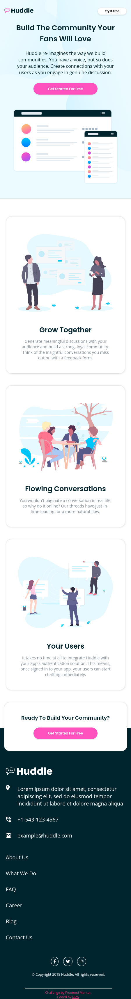

# Frontend Mentor - Huddle landing page with alternating feature blocks solution

This is a solution to the [Huddle landing page with alternating feature blocks challenge on Frontend Mentor](https://www.frontendmentor.io/challenges/huddle-landing-page-with-alternating-feature-blocks-5ca5f5981e82137ec91a5100). Frontend Mentor challenges help you improve your coding skills by building realistic projects. 

## Table of contents

- [Frontend Mentor - Huddle landing page with alternating feature blocks solution](#frontend-mentor---huddle-landing-page-with-alternating-feature-blocks-solution)
  - [Table of contents](#table-of-contents)
  - [Overview](#overview)
    - [The challenge](#the-challenge)
    - [Screenshot](#screenshot)
    - [Links](#links)
  - [My process](#my-process)
    - [Built with](#built-with)
    - [What I learned](#what-i-learned)
    - [Continued development](#continued-development)
    - [Useful resources](#useful-resources)
  - [Author](#author)
  - [Acknowledgments](#acknowledgments)

## Overview

### The challenge

Users should be able to:

- View the optimal layout for the site depending on their device's screen size
- See hover states for all interactive elements on the page

### Screenshot



### Links

- Solution URL: [My solution - github](https://github.com/angelofdeity/Huddle_landing_page)
- Live Site URL: [Add live site URL here](https://angelofdeity.github.io/Huddle_landing_page/)

## My process

### Built with

- Semantic HTML5 markup
- CSS custom properties
- Flexbox
- CSS Grid
- Mobile-first workflow


### What I learned

This particular piece of code helped me change the color of the huddle logo to white. I was able to do this by using the filter property and setting the brightness to 0 and invert to 1. I also used the calc() function to make the logo responsive.
```css
/* .proud-of-this-css { */
  footer .huddle_logo .img_logo{
    width: calc(180px + 4.2vw);
    filter: brightness(0) invert(1);
} 
/* } */
```
### Continued development
Not sure yet...


### Useful resources

- [Learn CSS grid the easy way](https://youtu.be/rg7Fvvl3taU) - This helped me really understand css grid. Its a great video to watch if you want to learn css grid.
## Author

- Website - [Nico](https://www.lanico.tech)
- Twitter - [@angelofdeity](https://www.twitter.com/angelofdeity)

## Acknowledgments

[Kevin Powell YT](https://www.youtube.com/watch?v=3-2PjvmnysQ) for the tutorial on how to use css grid, and many other tutorials on his channel.

[John Adibe](https://github.com/Johnadibe) for suggesting this project to me, reviewing my code and helping when I got stuck.
